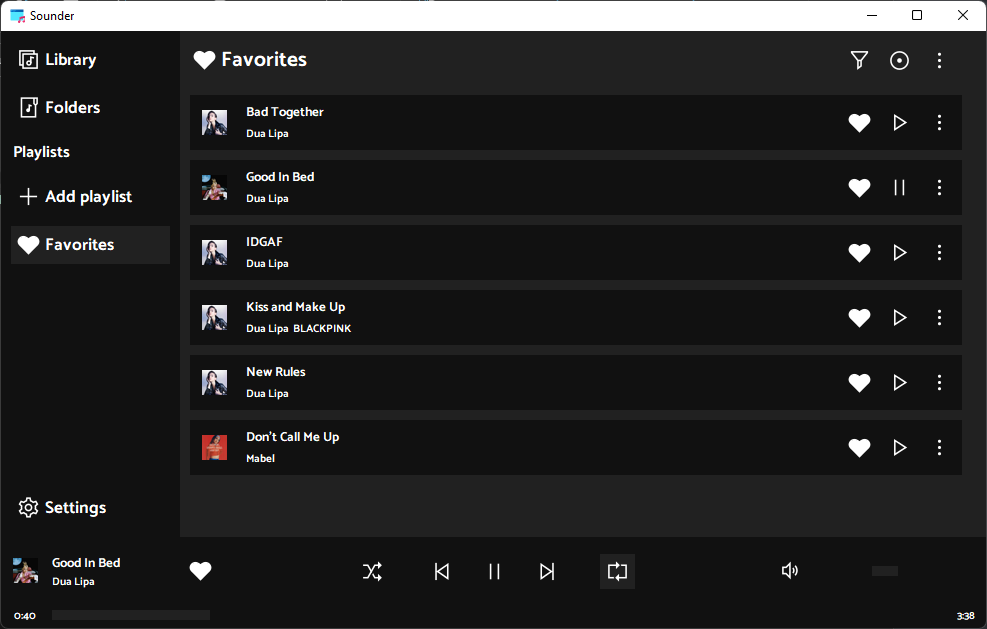

# Sounder5
## Music player written in python!
#### Note: Sounder is still in development. Please keep in mind that the final appearance may change!
#

## Used Libraries:
- tkinter
- pillow
- mutagen
- requests
- threading
- os
- typing
- json
- logging
- traceback
- random
- string

### Sounder logo:
Logo designer: [reallinfo](https://github.com/reallinfo)

### Sounder icons:
Icons: [icons8](https://icons8.com/)

### TODOs

Usability:
- Add better playlist managment.
- Add songs cache.
- Add proper version checking and build checking for update.
- Add custom messages.
- add a check for file size when adding songs.
- Create a new engine for managing the playback of songs.

Visual:
- Add more visual effects to panels.
- Unify appearance of panels.

Technical:
- Add a function that disables music playback on crash.
- Improve performance of some functions.
- Improve error handling / reporting. 
- Reduce startup time.

#

